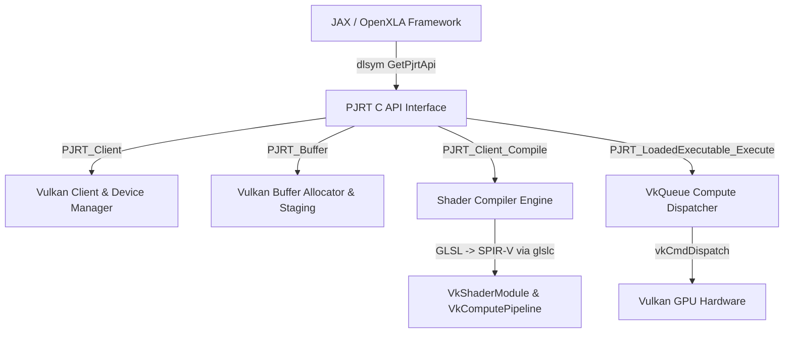

# Vulkan PJRT Plugin

Native **Vulkan PJRT Plugin** implementing the [OpenXLA PJRT C API](https://openxla.org/) specification for acceleration of compute operations (JAX / XLA) on Vulkan-compatible GPUs.

---

## 🌟 Features

- **OpenXLA PJRT C API Specification**: Implements standard `pjrt_c_api.h` and exports `GetPjrtApi()` ABI entrypoint for dynamic loading by machine learning frameworks (`.so` / `.dylib`).
- **Native Vulkan Compute Engine**: Directly manages `VkInstance`, `VkPhysicalDevice`, `VkDevice`, `VkQueue` compute family, `VkCommandPool`, `VkBuffer`, and GPU device memory allocations.
- **On-The-Fly SPIR-V Compiler**: Integrates shader compilation engine (`glslc`) to build optimized SPIR-V compute kernels dynamically for operations like GEMM / Matrix Multiplication (`stablehlo.dot`), Elementwise Ops (`add`, `sub`, `mul`, `div`), Scaling, ReLU, and custom GLSL compute shaders.
- **Robust Introspection Stubs**: Gracefully satisfies XLA/PJRT C API executable introspection calls (`PJRT_Executable_Serialize`, `PJRT_Executable_OptimizedProgram`) without memory allocation panics or ABI incompatibilities.
- **High-Performance Execution**: Synchronously and asynchronously dispatches to Vulkan GPU compute queues with descriptor set binding and staging buffer memory management.
- **JAX Integration**: Python bindings for registering the Vulkan PJRT plugin via `PJRT_NAMES_AND_LIBRARY_PATHS` and JAX plugin hooks.

---

## 🏛️ Architecture Overview



### Core C++ Components

1. **`pjrt_c_api.h` / `src/pjrt_c_api.cc`**:
   - Defines the standard OpenXLA C struct dispatch table `PJRT_Api`.
   - Exports `const PJRT_Api* GetPjrtApi()` symbol.
   - Handles client, device, buffer, executable, error, and event lifecycles.

2. **`vulkan_backend.h` / `src/vulkan_backend.cc`**:
   - Vulkan device initialization (`vkCreateInstance`, physical device selection, compute queue discovery, `vkCreateDevice`).
   - Vulkan memory allocation (Device Local memory for fast GPU compute, Host Visible/Coherent staging buffers for transfers).

3. **`vulkan_buffer.h` / `src/vulkan_buffer.cc`**:
   - `PJRT_Buffer` implementation holding Vulkan `VkBuffer` handle, element type (`float32`, `int32`, etc.), tensor shape/dimensions, and row-major byte strides.

4. **`vulkan_compiler.h` / `src/vulkan_compiler.cc` & `vulkan_executable.h` / `src/vulkan_executable.cc`**:
   - SPIR-V lowering engine using `glslc` compiler.
   - Generates and compiles compute shaders for elementwise ops and matrix multiplication (`GEMM`).
   - Computes descriptors, `VkPipelineLayout`, and `VkComputePipeline`.
   - Dispatches grid dispatches to Vulkan compute queue and reads results back.

---

## 🛠️ Requirements & Building

### Prerequisites

- GCC / Clang (C++17 compiler support)
- CMake >= 3.16 & Ninja
- Vulkan SDK / `libvulkan.so`
- `glslc` (Vulkan shader compiler tool)
- Python >= 3.12 (with `jax`, `jaxlib`, and `uv`)

### 1. Build the Dynamic Shared Library (`libvulkan_pjrt.so`)

```bash
mkdir build && cd build
cmake -G Ninja ..
ninja
cp libvulkan_pjrt.so ../vulkan_pjrt/vulkan_pjrt.so
cd ..
```

### 2. Run the Unit Tests

```bash
# Run backend and memory transfer tests
uv run python -m unittest tests/test_vulkan_backend.py

# Run GPU compute & SPIR-V shader tests
uv run python -m unittest tests/test_pjrt_c_api.py

# Run JAX plugin registration test
uv run python -m unittest tests/test_jax_integration.py
```

### 3. Run the Demonstration Script

```bash
uv run main.py
```

---

## 💻 Python Usage Example (High-Level JAX API)

```python
import jax
import jax.numpy as jnp

# Print available devices (registers and shows Vulkan GPU)
print("Devices:", jax.devices())

# Create matrices on Vulkan GPU
a = jax.random.uniform(jax.random.key(0), (64, 128))
b = jax.random.uniform(jax.random.key(42), (128, 256))

# Execute GEMM (Matrix Multiplication) on Vulkan GPU Compute Pipeline
c = a @ b

print("Result shape:", c.shape)
print("Result device:", c.device)
# Output:
# Devices: [Vulkan: AMD Radeon Graphics (RADV RENOIR)]
# Result shape: (64, 256)
# Result device: Vulkan: AMD Radeon Graphics (RADV RENOIR)
```

---

## 📄 License

Apache License 2.0 - see [`LICENSE`](file:///home/shinapri/Documents/proj/vulkan-pjrt/LICENSE.md) for details.
